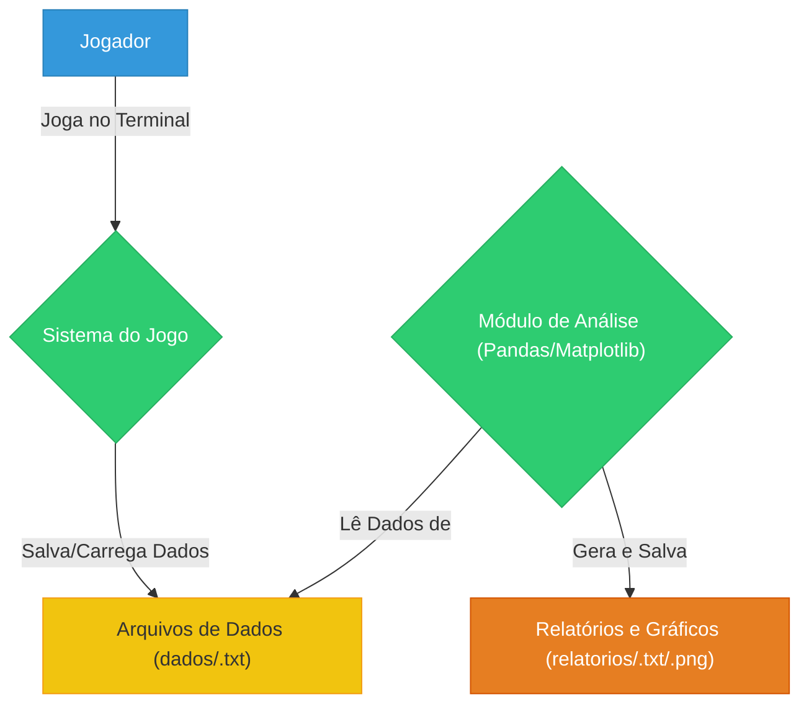
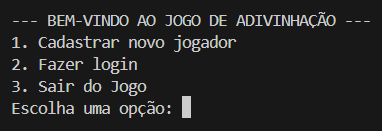
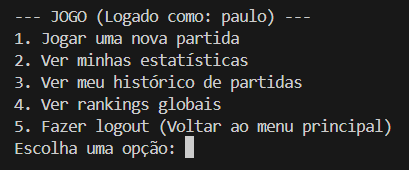
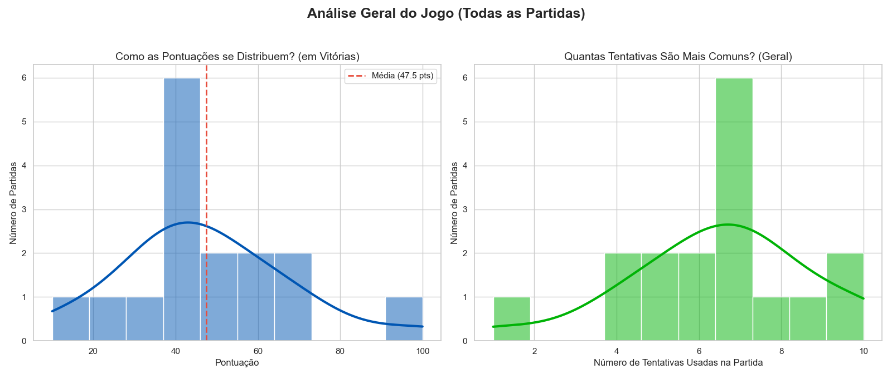

# 🧠 Projeto 04: Sistema de Jogo de Adivinhação

**Disciplina:** Programação para Ciência de Dados  
**Curso:** MBA Ciência de Dados UNIFOR  
**Instrutor:** Cássio Pinheiro  

**Integrantes:**  
- Paulo Everton Souza Rodrigues (2528750)


**Repositório GitHub:** [https://github.com/PauloEverton05/projeto_04_sistema_jogo_adivinhacao.git](https://github.com/PauloEverton05/projeto_04_sistema_jogo_adivinhacao.git)

**Data de Entrega:** 14/11/2025

---

## 🎯 1. Objetivo do Projeto

O objetivo deste projeto é criar um sistema completo de **Jogo de Adivinhação**, que não apenas permita aos usuários jogar, mas também capture, armazene e analise o desempenho dos jogadores.

O projeto resolve o problema de persistência e análise de dados de um jogo simples, transformando-o em um pequeno sistema de **data analytics**. Ele é voltado para demonstrar a integração de fundamentos de **Python** (para a lógica do jogo) com bibliotecas de **Ciência de Dados** como `Pandas` (para análise de dados) e `Matplotlib`/`Seaborn` (para visualização de insights).

---

## 🗺️ 2. Diagrama de Contexto (Mermaid)



---

## ⚙️ 3. Funcionalidades Implementadas

O sistema é dividido em **duas partes principais**: o **Jogo** e o **Módulo de Análise**.

### 🎮 Módulo 1: Lógica do Jogo (Fundamentos de Python)

- **Cadastro de Jogadores:** Permite que novos jogadores criem um usuário e nome.  
- **Login de Jogadores:** Autentica jogadores existentes.  
- **Sistema de Jogo:**  
  - Gera um número secreto (1–100).  
  - Permite até **10 tentativas**.  
  - Fornece **dicas** (maior/menor). 

- **Pontuação:**  
  - Começa com **100 pontos** de base.  
  - Cada tentativa usada (além da primeira) remove **10 pontos**.  
  - Exemplo:  
    - 1ª tentativa → 100 pts  
    - 2ª tentativa → 90 pts  
    - 10ª tentativa → 10 pts  
    - Sem acerto em 10 tentativas → **0 pts**  

- **Estatísticas e Rankings:**  
  - Estatísticas individuais (vitórias, derrotas, pontuação média).  
  - Rankings globais (pontuação, vitórias, média).  

- **Persistência de Dados:**  
  - Armazena dados em `dados/jogadores.txt` e `dados/partidas.txt`.  
  - Gera relatórios `.txt` e `.png` na pasta `/relatorios`.

---

### 📊 Módulo 2: Análise de Dados (Pandas & NumPy)

- **Carregamento de Dados:** Conversão em DataFrames.  
- **Limpeza e Transformação:** Conversão de colunas de datas.  
- **Análises:** Estatísticas agregadas, filtragem e seleção.  
- **Estatísticas Descritivas:** Média, distribuição e desempenho geral.

---

### 📈 Módulo 3: Visualização (Matplotlib & Seaborn)

- **Ranking de Vitórias:** Gráfico de barras (Top 5 jogadores).  
- **Distribuição de Pontuações:** Histograma geral.  
- **Tentativas por Partida:** Boxplot com dispersão.

---

## 🧩 4. Estrutura de Dados

**Entrada (Jogo):**  
- Nome (`str`), usuário (`str`) e palpites (`int`).

**Estruturas Internas:**  
```python
jogadores = {'user1': {'nome': 'Nome', 'data_cadastro': datetime_obj}}
partidas = [{'id': 1, 'jogador': 'user1', 'numero_secreto': 80, ...}]
```

**Persistência:**  
```
dados/jogadores.txt → dicionário serializado  
dados/partidas.txt → lista serializada
```

**Análise (Pandas):**  
```
df_jogadores → DataFrame de jogadores  
df_partidas → DataFrame de partidas
```

**Saída:**  
```
/relatorios/*.txt → relatórios de texto  
/relatorios/*.png → gráficos
```

---

## 💻 5. Requisitos Técnicos

- **Python:** v3.9+  
- **Bibliotecas:** `pandas`, `numpy`, `matplotlib`, `seaborn`

**Instalação:**  
```bash
git clone https://github.com/PauloEverton05/projeto_04_sistema_jogo_adivinhacao.git

cd PROJETO_04_SISTEMA_JOGO_ADIVINHACAO

python -m venv venv

venv\Scripts\activate  # Windows

pip install -r requirements.txt
```

---

## ▶️ 6. Como Executar o Projeto

Execute o jogo e análises com:  
```bash
python jogo_adivinhacao.py
```

O menu interativo permite jogar, visualizar estatísticas e rankings, com gráficos exibidos automaticamente.

---

## 📈 7. Análises Realizadas

A análise usa o `df_partidas`, contendo o histórico de todas as partidas.

- **Desempenho Geral:** Média de [X] pontos, [Y] tentativas.  
- **Ranking de Jogadores:** `groupby('jogador')` → melhores jogadores.  
- **Distribuição de Tentativas:** Histograma e boxplot mostram que a maioria termina entre [A] e [B] tentativas.

---

## 🗂️ 8. Estrutura do Projeto

```
PROJETO_04_SISTEMA_JOGO_ADIVINHACAO/
│
├── 📁 dados/
│   ├── jogadores.txt
│   └── partidas.txt
│
├── 📁 relatorios/
│   └── (relatórios .txt e .png gerados)
│
├── 📁 venv/
│   └── (ambiente virtual)
│
├── 🧾 .gitignore
├── 🕹️ jogo_adivinhacao.py
├── 📦 requirements.txt
└── 📘 README.md
```

---

## 9. Capturas de Tela / Exemplos de Saída

**Exemplo de Saída do Terminal (Jogo):**





**Exemplo de Gráfico (Ranking de Vitórias):**


**Exemplo de Gráfico (Distribuição de Pontuações):**




---

## 🧪 10. Testes Realizados

* **Cadastro:** Teste de cadastro de novo usuário.
* **Login:** Teste de login com usuário válido e inválido.
* **Validação de Jogo:** Teste de inserção de valores não numéricos, números fora do intervalo (1-100).
* **Lógica de Jogo:** Teste de vitória (acertar o número) e derrota (esgotar 10 tentativas).
* **Cálculo de Pontos:** Verificação manual se a pontuação (100 - (tentativas-1) * 10) estava correta.
* **Persistência:** Verificação se os arquivos `jogadores.txt` e `partidas.txt` foram criados e atualizados corretamente após jogar e sair.
* **Análise de Dados:** Verificação se os DataFrames foram carregados corretamente e se os gráficos gerados refletem os dados dos arquivos `.txt`.

---

## 📚 11. Referências

- [Documentação Pandas](https://pandas.pydata.org/docs/)  
- [Documentação Matplotlib](https://matplotlib.org/stable/contents.html)  
- Material da disciplina

---

## 👤 12. Contribuições

- **Paulo Everton Souza Rodrigues**.
  - Desenvolvimento integral do projeto, incluindo a lógica do jogo (Módulo 1), a implementação das análises com Pandas (Módulo 2) e a criação das visualizações com Matplotlib/Seaborn (Módulo 3).

  - Foi utilizada inteligência artificial como ferramenta de auxílio para a estruturação inicial do esqueleto do projeto e para consulta de documentação de funções específicas, não para a geração do código lógico final.

---

## 🚀 13. Melhorias Futuras

* **Migrar de `.txt` para CSV/JSON:** Substituir o método de salvar com `ast.literal_eval` por um formato de dados mais robusto como CSV ou JSON, o que facilitaria a leitura com `pd.read_csv()` ou `pd.read_json()`.
* **Interface Gráfica:** Criar uma interface gráfica simples para exibir as visualizações de forma interativa.
* **Mais Análises:** Analisar o "tempo por partida" ou a "hora do dia" em que os jogadores têm melhor desempenho.